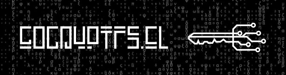

# GoCryptFs.el

gocryptfs.el is a tool to easily mount and unmount an encrypted folder to store its most sensitive data.

## Inspiration

This package is inspired by the [code embedded in @abougouffa&rsquo;s minemacs distribution](https://github.com/abougouffa/minemacs/blob/main/elisp/ecryptfs.el).

## Requirements

-   install [gocryptfs](https://github.com/rfjakob/gocryptfs)

    `sudo pacman -S gocryptfs`

-   Initialize new encrypted filesystem

        gocryptfs -init [OPTIONS] CIPHERDIR

    see [manpage](https://github.com/rfjakob/gocryptfs/blob/master/Documentation/MANPAGE.md#initialize-new-encrypted-filesystem)

## Installation

    (use-package gocryptfs
       :straight (:local-repo "~/your folder/gocryptfs"))

## Use

./assets/demo.mp4

## Project

-   [ ] add init auto
-   [ ] add reverse mode option
